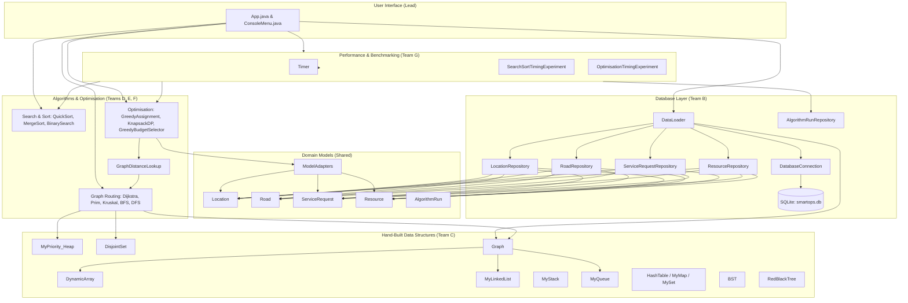

# Ghana Smart Service Operations Optimizer — System Architecture

## 1. High-Level Architecture Overview

---

## 2. Component Responsibilities

| Subsystem | Key Components | Responsibilities |
|---|---|---|
| **User Interface** | `App.java`, `ConsoleMenu.java` | Interactive command-line menu, workflow routing, formatted output presentation. |
| **Database & Models** | `schema.sql`, `DatabaseConnection`, Repositories, Domain Models | Persistence in SQLite, relational entity hydration, typed models. |
| **Data Structures** | `MyPriority_Heap`, `HashTable`, `Graph`, `DynamicArray`, `DisjointSet` | Pure from-scratch data structure implementations satisfying academic constraints. |
| **Graph Routing** | `Dijkstra.java`, `Prim.java`, `Kruskal.java`, `BFS.java`, `DFS.java` | Single-source shortest path, minimum spanning trees, reachability analysis. |
| **Optimisation** | `GreedyAssignment`, `KnapsackDP`, `GreedyBudgetSelector` | Request dispatching, 0/1 knapsack budget allocation, algorithm failure counterexamples. |
| **Performance** | `Timer`, `SearchSortTimingExperiment`, `OptimisationTimingExperiment` | Nanosecond precision timing benchmarks, CSV export, Big-O empirical verification. |
