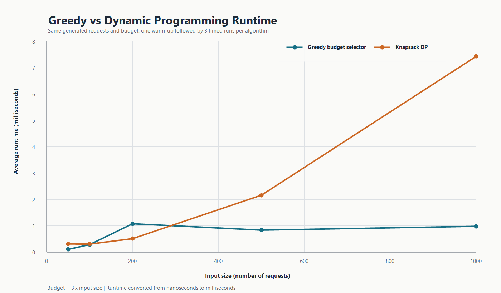

# Optimisation Engine: Greedy Budget Selection vs Dynamic Programming

## Purpose

Team F compared two algorithms that solve the same problem: select service requests with the
highest total value without exceeding a fixed budget. Both algorithms receive the same request
list, costs, values and budget at every input size. This makes the runtime and solution-quality
comparison fair.

The greedy algorithm considers requests from highest to lowest value-to-cost ratio and accepts
each request that fits. The dynamic programming algorithm uses 0/1 knapsack tabulation to examine
both choices for every request: exclude it, or include it when the remaining budget allows.

## Experimental method

The experiment used deterministic generated data so another run can reproduce the same inputs.

- Input sizes: 50, 100, 200, 500 and 1,000 requests
- Budget: three times the input size, from 150 to 3,000
- Request cost: a generated integer from 1 to 10
- Request value: `urgency * 10` plus a generated value from 0 to 9
- Random seed: `204308 + input size`
- Timing: one untimed warm-up, followed by 3 measured runs per algorithm
- Reported time: the arithmetic mean of the 3 measured runs
- Timer: `Timer.timeInNanos(...)`

Data generation and CSV writing were not included in the measured time. Only the algorithm call
was timed. The same generated list was reused for greedy and DP at each size.

## Results

| Requests | Budget | Greedy time (ms) | DP time (ms) | Greedy value | DP value | DP value gain |
|---:|---:|---:|---:|---:|---:|---:|
| 50 | 150 | 0.104 | 0.311 | 981 | 981 | 0 |
| 100 | 300 | 0.287 | 0.306 | 1,864 | 1,866 | 2 |
| 200 | 600 | 1.078 | 0.512 | 3,732 | 3,732 | 0 |
| 500 | 1,500 | 0.836 | 2.162 | 9,577 | 9,580 | 3 |
| 1,000 | 3,000 | 0.980 | 7.428 | 18,982 | 18,988 | 6 |

The raw measurements are in
[`data/results/optimisation-timing.csv`](../../data/results/optimisation-timing.csv). The hardware
and software details are recorded in
[`optimisation-machine-spec.md`](optimisation-machine-spec.md).

## Runtime interpretation

At 50 and 100 requests, both algorithms finish in less than one millisecond, so their absolute
difference is small. At 500 requests, DP takes about 2.6 times as long as greedy. At 1,000
requests, DP takes about 7.6 times as long: 7.428 ms compared with 0.980 ms. The gap at the largest
input shows the extra work and memory required to build the DP table.

The current greedy implementation manually orders requests using insertion sort. Its ordering
step is O(n²) in the average and worst cases, followed by an O(n) selection pass. It also stores
an O(n) copy of the request list. The DP implementation takes O(nB) time and O(nB) memory, where
`B` is the budget. Because this experiment sets `B = 3n`, DP also grows quadratically with input
size under this specific setup. Its two-dimensional table gives it a larger memory cost and a
larger practical constant at higher input sizes.

The 200-request result does not follow the overall trend: greedy takes 1.078 ms, while its
500-request run takes 0.836 ms, and DP is faster than greedy at 200 requests. Each input size uses
a deterministic but different generated list rather than a prefix of one list. Insertion sort is
sensitive to the initial order of its input, so one generated order can require more shifts than
another. JVM compilation, garbage collection and operating-system scheduling also matter when
the measurements are below a few milliseconds. One warm-up and three averaged runs reduce this
noise but do not remove it. A dedicated Java benchmark framework and more repetitions would be
needed for precise microbenchmark claims.

## Solution-quality interpretation

DP is never worse than greedy in these results. The algorithms tie at 50 and 200 requests. DP
finds 2 more value points at 100 requests, 3 more at 500 requests and 6 more at 1,000 requests.
The differences are small in percentage terms, but they demonstrate the important guarantee:
DP considers every valid include-or-exclude choice represented by the table, while greedy commits
to each locally attractive ratio choice and never revisits it.

This experiment does not prove that greedy is always close to optimal. The separate three-request
counterexample is deliberately constructed to show a clearer failure: with budget 4, greedy
selects value 5, while DP selects value 6. The scaling experiment answers a different question:
how runtime and solution quality behave on larger deterministic inputs.

## Responsible algorithm selection

Use greedy selection when a fast answer matters more than a guaranteed optimum, especially when
the request set or budget is large. It uses much less memory than the DP table and produced values
close to the optimum in this dataset.

Use dynamic programming when the highest possible total value is required and the budget is small
enough for an `n x budget` table. DP was equal or better at every measured size, but its runtime
grew much more sharply by 1,000 requests.

The operational choice is therefore not that one algorithm is universally better. Greedy offers
speed and lower memory use; DP offers an optimal value under the stated 0/1 knapsack model.

## Limitations

- The requests are deterministic generated inputs, not records loaded from the project database.
- Cost and value still need an agreed mapping from the database fields before final integration.
- Three measured runs are enough for the project protocol but not for rigorous JVM benchmarking.
- Increasing request count and budget together shows the combined scaling effect. A separate
  experiment that holds one variable fixed would isolate each factor more clearly.
- The current greedy ordering uses insertion sort. Replacing it with an O(n log n) generic sort
  from Team D would change the greedy growth curve and should trigger a fresh timing run.
